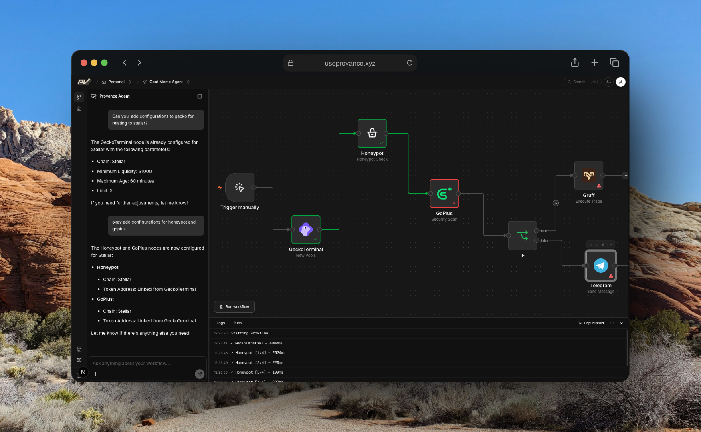

# provance-nodes

The agent execution layer for Provance. Every node in this repo is a live HTTP service that the Provance canvas calls when a workflow runs. Each node receives an action and a set of parameters, does its job, and returns structured output.

This is where the actual work happens.

---

## What lives here

```
provance-nodes/
├── src/
│   ├── app.ts          # Express app — registers all node routes
│   ├── server.ts       # Entry point
│   ├── config.ts       # Environment config
│   └── middleware/
│       └── cors.ts
└── nodes/
    ├── blaze/          # Stellar AI trading agent
    ├── dexscreener/    # New token detection on Base
    ├── geckoterminal/  # Multi-chain pool scanner
    ├── goplus/         # On-chain token security scanner
    ├── gruff/          # GOAT Network AI trading agent
    ├── honeypot/       # Buy/sell simulation
    ├── openai/         # GPT prompt runner
    ├── telegram/       # Telegram message sender
    └── core/
        └── modules/
            └── trigger/ # Schedule and webhook triggers
```

---

## How it works

When a Provance workflow runs, the engine calls `POST /{node}/run` for each node in the graph. The request body always includes an `action` field plus whatever parameters the user configured.

```json
{
  "action": "new_pools",
  "chain": "base",
  "min_liquidity_usd": "10000",
  "max_age_minutes": "2880",
  "limit": "10"
}
```

The node handles the action, does the work, and responds:

```json
{
  "success": true,
  "data": {
    "token_address": "0x...",
    "symbol": "PEPE",
    "price_usd": 0.0000012,
    "liquidity_usd": 45000
  },
  "message": "Found 3 new pools"
}
```

Outputs from one node flow into the next. The canvas links them.

---

## Available nodes

| Node | Route | Category | What it does |
|------|-------|----------|--------------|
| **DexScreener** | `/dexscreener` | DeFi Data | Detects newly listed tokens on Base, filtered by liquidity and age |
| **GeckoTerminal** | `/geckoterminal` | DeFi Data | Scans new pools across chains in real time — 5 actions including OHLCV and trending pools |
| **GoPlus** | `/goplus` | Security | Runs on-chain security checks — detects honeypots, rug pulls, and risk flags |
| **Honeypot** | `/honeypot` | Security | Simulates a real buy and sell to confirm a token can actually be sold |
| **OpenAI** | `/openai` | AI | Runs a prompt through GPT-4o and returns the response |
| **Telegram** | `/telegram` | Notifications | Sends formatted messages to a Telegram channel or group |
| **Gruff** | `/gruff` | DeFi | AI trading agent on GOAT Network — checks balances, gets quotes, executes swaps via OKU |
| **Blaze** | `/blaze` | DeFi | AI trading agent on Stellar — reads order books, executes swaps and limit orders via SDEX |
| **Trigger** | `/core/trigger` | Core | Schedule and webhook trigger handling |

---

## Running locally

**1. Install dependencies**

```bash
pnpm install
```

**2. Set environment variables**

Copy the root env file and fill it in:

```bash
cp .env.example .env
```

Root `.env`:

```env
PORT=3100
```

Each node that needs secrets has its own `.env` inside its folder. Set those up too:

```
nodes/blaze/.env       — STELLAR_AGENT_SECRET_KEY, SOROSWAP_API_KEY
nodes/gruff/.env       — GOAT_PRIVATE_KEY, GOAT_RPC_URL
nodes/openai/.env      — OPENAI_API_KEY
nodes/telegram/.env    — TELEGRAM_BOT_TOKEN
```

**3. Start the dev server**

```bash
pnpm dev
```

The server starts on `http://localhost:3100`. Hit `/health` to confirm all nodes are registered.

**4. Test a node**

```bash
curl -X POST http://localhost:3100/geckoterminal/run \
  -H "Content-Type: application/json" \
  -d '{"action": "new_pools", "chain": "base", "min_liquidity_usd": "10000", "limit": "5"}'
```

---

## Building

```bash
pnpm build   # compiles TypeScript to dist/
pnpm start   # runs the compiled output
```

---

## Adding a new node

Each node follows the same pattern. Here is how to add one.

**1. Create the node folder**

```
nodes/your-node/
├── your-node.route.ts       # Express router — mounts /run
├── your-node.controller.ts  # Handles the request, dispatches by action
├── your-node.schema.ts      # Zod schemas for each action's input
├── your-node.actions.ts     # The actual logic for each action
└── package.json             # Optional — only needed if the node has its own deps
```

**2. Write the controller**

The controller always reads `action` from the body and dispatches:

```ts
import { Request, Response } from "express";
import { MySchema } from "./your-node.schema";
import { doSomething } from "./your-node.actions";

export async function runYourNode(req: Request, res: Response): Promise<void> {
  const { action, ...params } = req.body ?? {};

  try {
    let data: unknown;

    switch (action) {
      case "do_something":
        data = await doSomething(MySchema.parse(params));
        break;
      default:
        res.status(400).json({ success: false, data: {}, message: `Unknown action: "${action}"` });
        return;
    }

    res.json({ success: true, data, message: "ok" });
  } catch (err) {
    const message = err instanceof Error ? err.message : "Unknown error";
    res.status(500).json({ success: false, data: {}, message });
  }
}
```

**3. Write the route**

```ts
import { Router } from "express";
import { runYourNode } from "./your-node.controller";

const router = Router();
router.post("/run", runYourNode);

export default router;
```

**4. Register it in `src/app.ts`**

```ts
import yourNodeRouter from "../nodes/your-node/your-node.route";
// ...
app.use("/your-node", yourNodeRouter);
```

**5. Add it to the health check**

In `src/app.ts`, add your node's name to the `nodes` array in the `/health` response.

**6. Register it in the canvas**

Add an entry to `AGENTS` in `provance-client/services/agent.service.ts` so it shows up in the node picker. Set `url` to `${NODES_URL}/your-node`.

---

## Node response format

Every node must return this shape:

```ts
{
  success: boolean;
  data: Record<string, unknown>;
  message: string;
}
```

On error, return `success: false` with a clear `message`. The engine surfaces this message in the run log.

---

## Deployment

The nodes server is deployed on Railway. The `railway.json` at the root handles the build and start commands. Push to the main branch and Railway picks it up automatically.

The live URL is `https://nodes.useprovance.xyz`. Each node is available at `https://nodes.useprovance.xyz/{node-name}/run`.

---

## Stack

- **Runtime** — Node.js + TypeScript
- **Framework** — Express
- **Validation** — Zod
- **Logging** — Pino
- **Package manager** — pnpm (workspaces)
- **Deploy** — Railway
