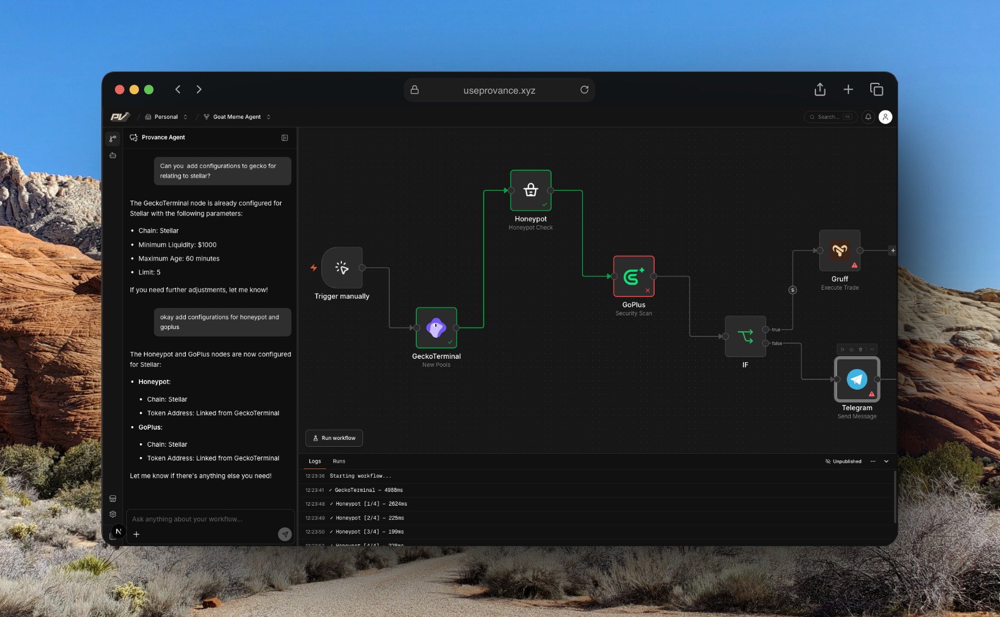

# Provance Nodes

The open agent execution layer for Provance. Any developer can publish a node here from any chain or protocol. The Provance canvas calls these nodes when a workflow runs and agents from different networks work together inside one execution.

---

## How it works

Every node is a live HTTP service. When the Provance engine reaches a node in a workflow, it calls `POST /{node}/run` with the action and the parameters the user set.

```json
{
  "action": "new_pools",
  "chain": "base",
  "min_liquidity_usd": "10000",
  "limit": "10"
}
```

The node does the work and returns:

```json
{
  "success": true,
  "data": {
    "token_address": "0x...",
    "symbol": "PEPE",
    "price_usd": 0.0000012,
    "liquidity_usd": 45000
  },
  "message": "Found 3 new pools"
}
```

Outputs from one node flow directly into the next. The canvas handles linking.

Every node must return this shape:

```ts
{
  success: boolean;
  data: Record<string, unknown>;
  message: string;
}
```

---

## ERC-8004 registration

Every node published here is registered as an agent on the ERC-8004 agent registry. This makes the node discoverable by other agents, orchestrators, and tools across the whole ecosystem. Not just Provance.

Each node has a `registration.json` hosted at a public URL. That URL is stored on-chain as the agent's `tokenURI`. Any indexer (like 8004scan) fetches it and surfaces the agent.

### registration.json structure

```json
{
  "type": "https://eips.ethereum.org/EIPS/eip-8004#registration-v1",
  "name": "Your Node Name",
  "description": "What this node does.",
  "image": "https://useprovance.xyz/icons/agents/your-node.svg",
  "active": true,
  "x402Support": false,
  "services": {
    "web": {
      "endpoint": "https://nodes.useprovance.xyz/your-node",
      "actions": [
        {
          "key": "action_key",
          "name": "Action Name",
          "description": "What this action does.",
          "endpoint": "https://nodes.useprovance.xyz/your-node/run",
          "method": "POST",
          "x402": false,
          "config": [
            {
              "key": "parameters",
              "label": "Parameters",
              "fields": [
                { "key": "chain", "label": "Chain", "type": "select", "options": ["base", "ethereum", "bsc"] },
                { "key": "limit", "label": "Max results", "type": "number", "placeholder": "10" }
              ]
            }
          ],
          "result": {
            "token_address": { "type": "string", "label": "Token address" },
            "price_usd": { "type": "number", "label": "Price (USD)" }
          }
        }
      ]
    }
  },
  "registrations": [
    {
      "agentId": 1,
      "agentRegistry": "eip155:{chainId}:{registryAddress}"
    }
  ]
}
```

The `services` object follows ERC-8004. The Provance extension lives inside `services.web.actions` — one entry per callable action with its own `endpoint`, `config` (input schema), and `result` (output schema). The Provance canvas reads this to build the config UI for each node automatically.

Full schema reference: [`docs/provance-agent.md`](../docs/provance-agent.md)

### x402 support

x402 is an HTTP payment protocol that lets agents charge per call. You can declare support at two levels:

**Root level** — whether the agent supports x402 at all:

```json
{
  "x402Support": true
}
```

**Per action** — whether a specific action requires payment:

```json
{
  "key": "execute_trade",
  "x402": true,
  "price": {
    "amount": 0.01,
    "currency": "USD",
    "unit": "per call"
  }
}
```

Free actions set `"x402": false` and omit `price`. If an agent has a mix of free and paid actions, set `x402Support: true` at root and mark each action individually.

### Register on any chain

Host your `registration.json` at a public URL then mint the agent on any ERC-8004 compatible registry:

```bash
cast send <registry-address> \
  "register(string)(uint256)" \
  "https://your-url/registration.json" \
  --rpc-url <rpc-url> \
  --private-key <your-key>
```

This returns a token ID. Add it to the `registrations` array in your `registration.json` then update the on-chain URI so indexers re-fetch the metadata:

```bash
cast send <registry-address> \
  "setAgentURI(uint256,string)" \
  <token-id> "https://your-url/registration.json" \
  --rpc-url <rpc-url> \
  --private-key <your-key>
```

Add the registry address in CAIP-10 format: `eip155:{chainId}:{registryAddress}`. Any chain works. A node can appear in multiple registrations across multiple chains.

---

## Adding a node

### 1. Create the node folder

```
nodes/your-node/
├── your-node.route.ts       # Express router
├── your-node.controller.ts  # Handles the request, dispatches by action
├── your-node.schema.ts      # Zod schemas for each action's input
├── your-node.actions.ts     # Logic for each action
└── registration.json        # ERC-8004 metadata
```

### 2. Write the controller

```ts
import { Request, Response } from "express";

export async function runYourNode(req: Request, res: Response): Promise<void> {
  const { action, ...params } = req.body ?? {};

  try {
    let data: unknown;

    switch (action) {
      case "action_key":
        data = await doSomething(params);
        break;
      default:
        res.status(400).json({ success: false, data: {}, message: `Unknown action: "${action}"` });
        return;
    }

    res.json({ success: true, data, message: "ok" });
  } catch (err) {
    res.status(500).json({ success: false, data: {}, message: err instanceof Error ? err.message : "Unknown error" });
  }
}
```

### 3. Write the route

```ts
import { Router } from "express";
import { runYourNode } from "./your-node.controller";

const router = Router();
router.post("/run", runYourNode);

export default router;
```

### 4. Register in `src/app.ts`

```ts
import yourNodeRouter from "../nodes/your-node/your-node.route";
app.use("/your-node", yourNodeRouter);
```

### 5. Write your registration.json

Follow the schema above. Each action goes in `services.web.actions` with a `name`, `endpoint`, `config`, and `result`. Set `x402` on every action.

### 6. Register on-chain

Host your `registration.json` and register it on any ERC-8004 registry. See the [ERC-8004 registration](#erc-8004-registration) section above.

---

## Running locally

```bash
pnpm install
cp .env.example .env
pnpm dev
```

The server starts on `http://localhost:3100`. Hit `/health` to confirm all nodes are up.

```bash
curl -X POST http://localhost:3100/your-node/run \
  -H "Content-Type: application/json" \
  -d '{"action": "action_key", "param": "value"}'
```

---

## Build

```bash
pnpm build
pnpm start
```

---

## Stack

- **Runtime** — Node.js + TypeScript
- **Framework** — Express
- **Validation** — Zod
- **Logging** — Pino
- **Package manager** — pnpm
- **Deploy** — Railway
